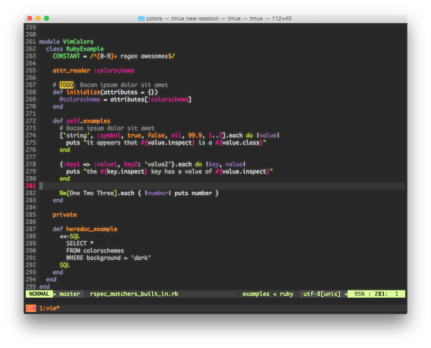
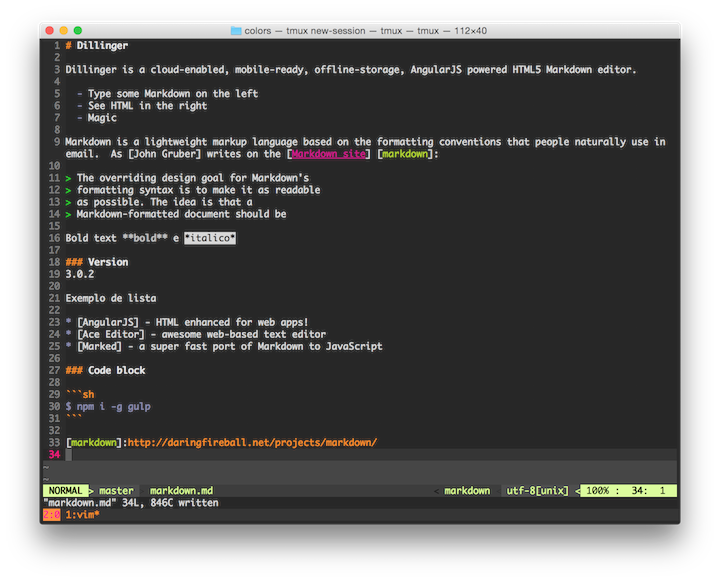
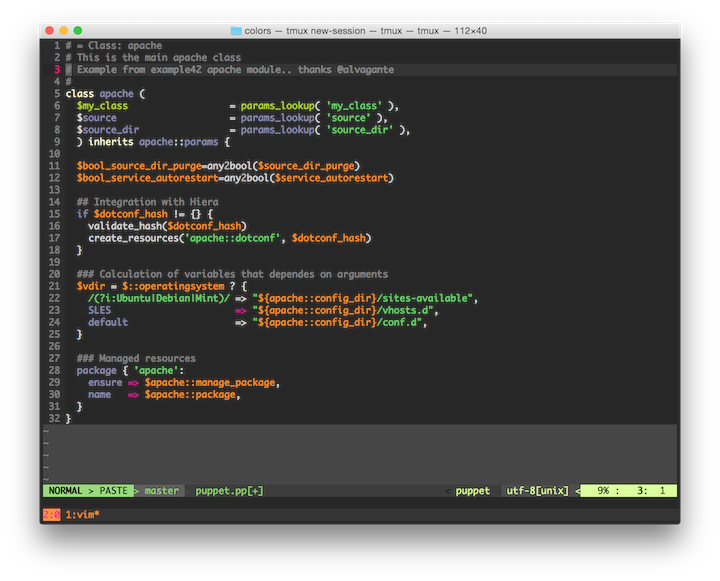

# Description

A terminal (256 colors) theme for vim

# Installation

* As at Zertico we use [Janus](https://github.com/carlhuda/janus) just
  need to clone to _~/.janus_ and set `colorscheme zertico` on
_~.vimrc.after_ file

# Screenshot

## Ruby Sample File

## Markdown Sample File

## Puppet Sample File

